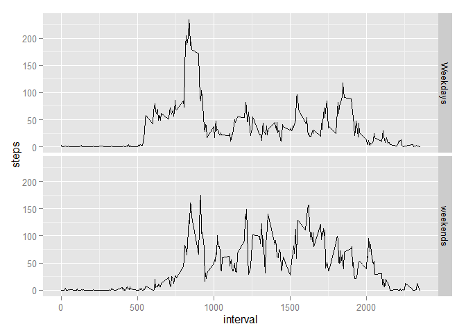

# Reproducible Research: Peer Assessment 1


## Loading and preprocessing the data

```r
data <- read.csv(unz("activity.zip","activity.csv"))
```

## What is mean total number of steps taken per day?

```r
dayTotal <- aggregate(steps ~ date, data, sum )
m <- mean(dayTotal$steps, na.rm = TRUE)
med <- median(dayTotal$steps, na.rm = TRUE)
```

- The mean = **1.0766189\times 10^{4}** 
- The median = **10765**

A histogram of the total number of steps taken each day

```r
hist(dayTotal$steps, xlab = "Total Steps / Day", main = "Histogram of Total Steps per day")
```

 

## What is the average daily activity pattern?

```r
intervalAvrg <- aggregate(steps ~ interval, data, mean )
```

A time series plot of the 5-minute interval against the average number of steps taken


```r
plot(intervalAvrg, type = "l")
```

 


```r
maxInterval <- intervalAvrg[intervalAvrg$steps == max(intervalAvrg$steps),]
```
The interval with the maximum number of steps is **835**

## Imputing missing values


```r
naSteps <- sum(is.na(data$steps))
```

Number of missing data rows = **2304**

Missing data can be filled using the average values per day :


```r
require(dplyr)
```

```
## Loading required package: dplyr
## 
## Attaching package: 'dplyr'
## 
## The following object is masked from 'package:stats':
## 
##     filter
## 
## The following objects are masked from 'package:base':
## 
##     intersect, setdiff, setequal, union
```

```r
data_filled <- merge(data,intervalAvrg,by= "interval") %>% 
    mutate(steps.x = ifelse(is.na(steps.x),steps.y,steps.x))

dayTotal_f <- aggregate(steps.x ~ date, data_filled, sum )
m_f <- mean(dayTotal_f$steps.x, na.rm = TRUE)
med_f <- median(dayTotal_f$steps.x, na.rm = TRUE)
hist(dayTotal_f$steps.x, xlab = "Total Steps / Day", main = "Histogram of Total Steps per day")
```

 


- The new mean = **1.0766189\times 10^{4}** (compared to 1.0766189\times 10^{4})
- The new median = **1.0766189\times 10^{4}** (compared to 10765)

The mean did not change since the missing values where filled using the average daily values, however the median has slightly shifted since the NA's that used to be ignored before now have real values shifting the median slightly higher


## Are there differences in activity patterns between weekdays and weekends?

Create a weekday/weekend factor to split the data

```r
library(lubridate)
data <- mutate(data, dayType = ifelse(weekdays(ymd(data$date))=="Saturday" | weekdays(ymd(data$date))=="Sunday", 1, 0))
data <- mutate(data, dayType = factor(dayType, labels=c("Weekdays", "weekends")))
intervalAvrg <- aggregate(steps ~ interval + dayType, data, mean )
library(ggplot2)
qplot(x = interval, y= steps, data = intervalAvrg, facets = dayType~., geom="line")
```

 

From the graphs we can see that steps made during weekdays are consistantly concentrated at the begining of the day while on weekends they tend to spread out through out the day.
